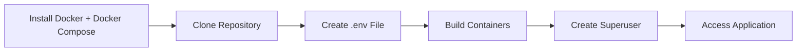
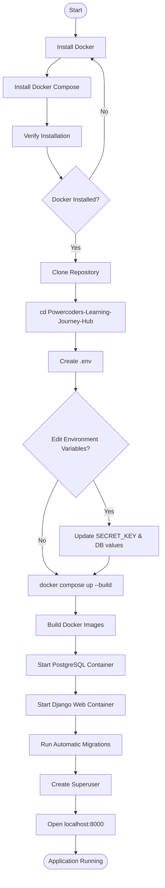
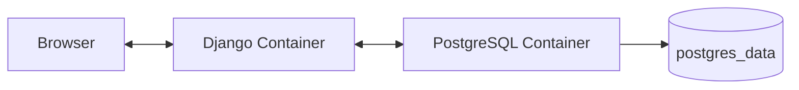
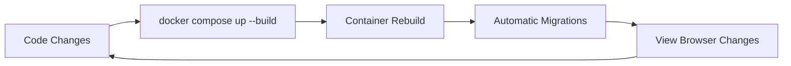
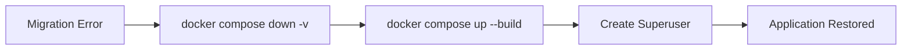

# PowerHub Workflow Documentation

This document contains Mermaid diagrams for GitHub rendering.

## Setup Pipeline

---

## Detailed Local Setup Flow

---

## Runtime Architecture

---

## Development Lifecycle

---

## Recovery Workflow

GitHub automatically renders Mermaid diagrams inside markdown files.
